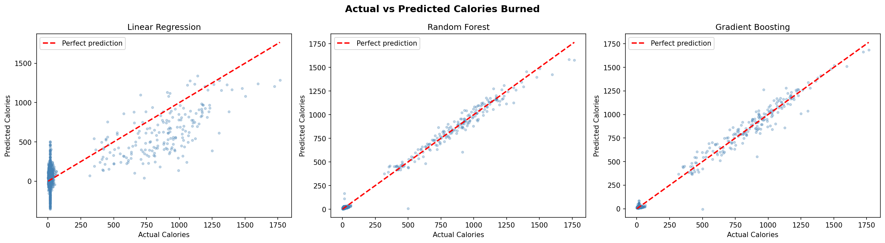
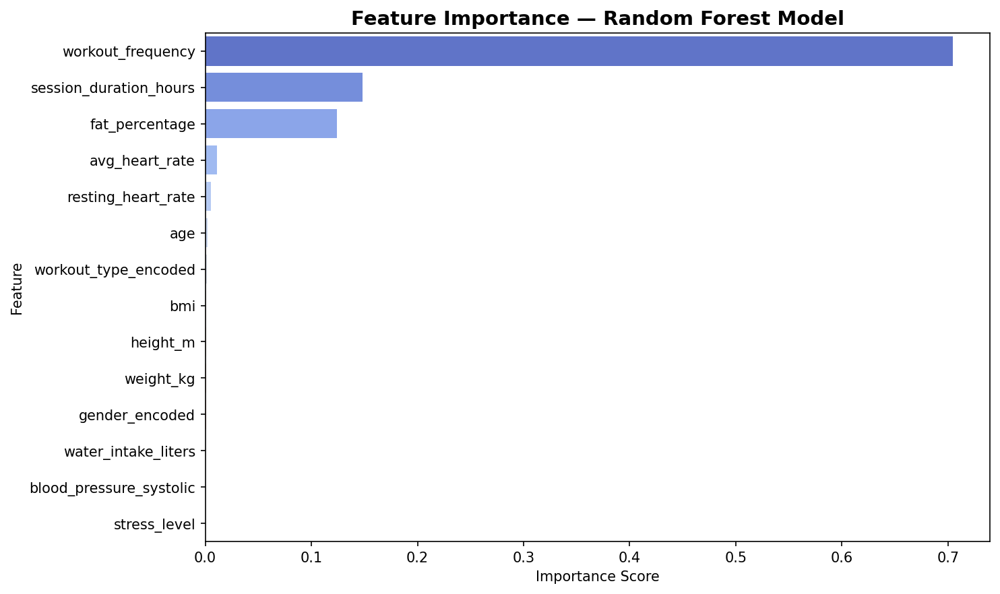
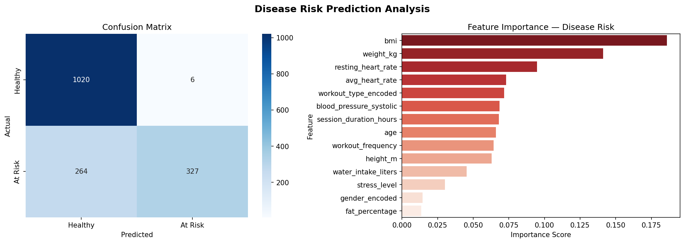
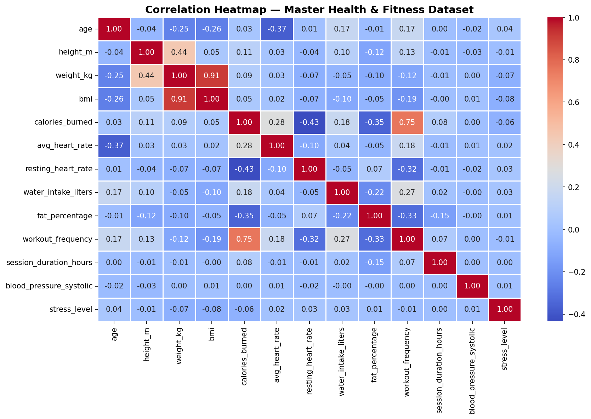
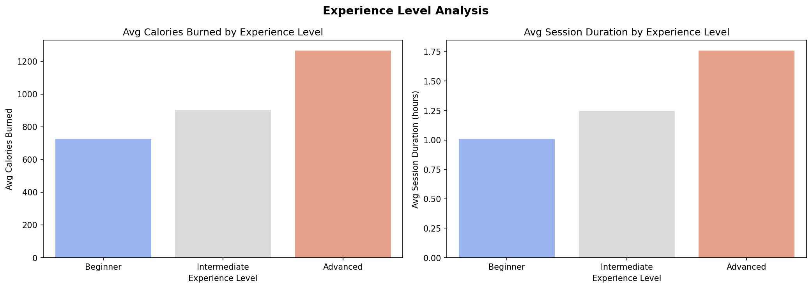
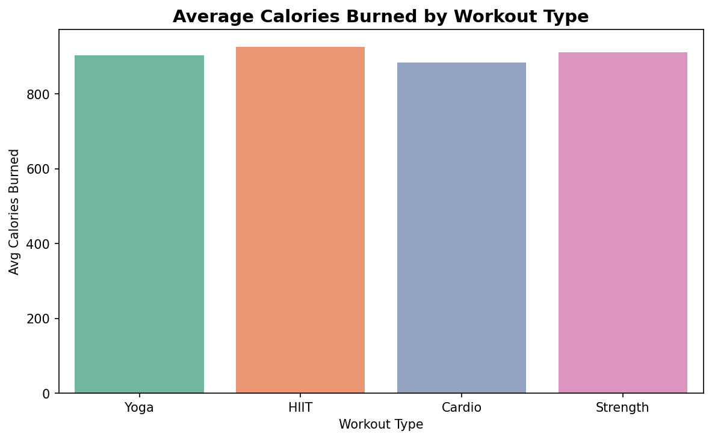
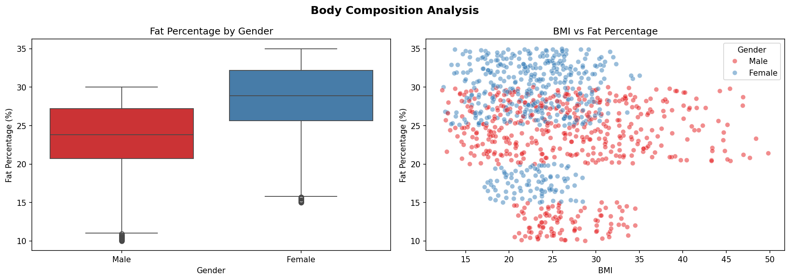
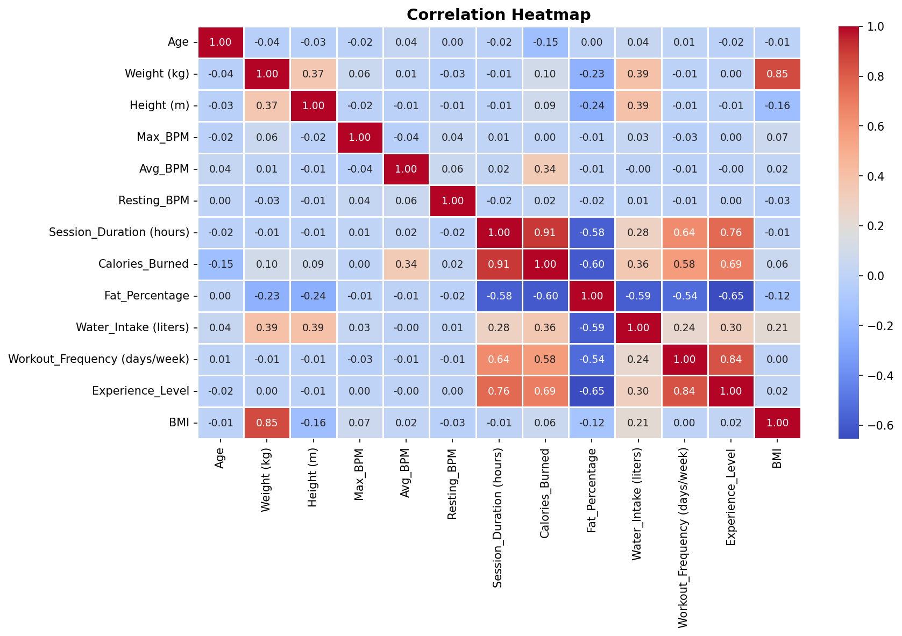

# 🏋️ Lifestyle Disease Prevention & Exercise Outcome Prediction

An independent machine learning research project that merges 3 public health datasets into a master dataset of **8,084 records** to predict calorie burn and classify lifestyle disease risk using Python and Scikit-learn.

---

## 📌 Project Overview

This project addresses two real-world health problems using machine learning:

1. **Regression Task** — Predict how many calories a person burns during exercise
2. **Classification Task** — Predict whether a person is at risk of a lifestyle disease (Diabetes, Hypertension, or Obesity)

The project was built entirely independently — from data collection and merging, to model training, evaluation, and insight extraction.

---

## 📊 Results

| Task | Model | Metric | Score |
|------|-------|--------|-------|
| Calorie Burn Prediction | Random Forest | R² Score | **0.9928** |
| Calorie Burn Prediction | Random Forest | MAE | **9.59 cal** |
| Disease Risk Classification | Random Forest | Accuracy | **83.3%** |
| Disease Risk Classification | Random Forest | Precision (At Risk) | **98%** |

---

## 🔑 Key Findings

- **Workout frequency** is the #1 driver of calorie burn (70.4% feature importance)
- **BMI and weight** are the top drivers of lifestyle disease risk (32.7% combined importance)
- Advanced gym members burn **75% more calories** than beginners (1,260 vs 720 avg)
- Session duration has the highest correlation with calories burned (r = 0.91)
- High BMI does not always mean high fat percentage — muscular members skew BMI upward

---

## 📁 Dataset

Three public datasets were merged into one master dataset:

| Dataset | Records | Key Features |
|---------|---------|--------------|
| Gym Members Exercise Tracking | 973 | Calories burned, session duration, workout type, experience level |
| Health & Fitness Dataset | 5,000 (sampled) | Health conditions, blood pressure, stress level, activity type |
| Obesity Lifestyle Dataset | 2,111 | Obesity level, physical activity frequency, dietary habits |
| **Master Dataset** | **8,084** | **20 features across all sources** |

---

## 🛠️ Tech Stack

- **Language:** Python 3
- **Libraries:** Pandas, NumPy, Scikit-learn, Matplotlib, Seaborn
- **Models:** Linear Regression, Random Forest, Gradient Boosting
- **Environment:** Jupyter Notebook

---

## 📂 Project Structure

```
├── notebooks/
│   ├── 01_EDA_gym_members.ipynb        # Exploratory data analysis on gym dataset
│   └── 02_ML_pipeline.ipynb            # Data merging, cleaning, modeling
├── data/
│   ├── gym_members_exercise_tracking.csv
│   ├── health_fitness_dataset.csv
│   ├── ObesityDataSet_raw_and_data_sinthetic.csv
│   └── master_health_fitness.csv       # Final merged dataset
├── visuals/
│   ├── model_comparison.png
│   ├── feature_importance.png
│   ├── disease_risk_analysis.png
│   ├── correlation_heatmap.png
│   ├── master_correlation.png
│   ├── experience_analysis.png
│   ├── calories_by_workout.png
│   └── body_composition.png
└── README.md
```

---

## 📈 Visualizations

### Model Comparison — Actual vs Predicted Calories


> Random Forest and Gradient Boosting both closely follow the perfect prediction line, while Linear Regression struggles due to non-linear relationships in the data.

---

### Feature Importance — Calorie Burn (Random Forest)


> Workout frequency dominates at 70.4% importance, followed by session duration and fat percentage.

---

### Disease Risk Prediction Analysis


> The classifier correctly identified 1,020 healthy individuals and 327 at-risk individuals. BMI and weight are the strongest predictors of disease risk.

---

### Correlation Heatmap — Master Dataset


> Workout frequency shows strong positive correlation (0.75) with calories burned, while resting heart rate shows negative correlation (-0.43).

---

### Experience Level Analysis


> Advanced members burn nearly double the calories of beginners and train 75% longer per session on average.

---

### Average Calories Burned by Workout Type


> All 4 workout types (Yoga, HIIT, Cardio, Strength) burn roughly equivalent calories (880–930 avg), suggesting session duration matters more than workout type.

---

### Body Composition Analysis


> Females have a higher average fat percentage than males (29% vs 24%), consistent with biological norms. High BMI does not consistently predict high fat percentage.

---

### Correlation Heatmap — Gym Members Dataset


---

## 🚀 How to Run

```bash
# Clone the repository
git clone https://github.com/Haroon6148/lifestyle-disease-ml.git
cd lifestyle-disease-ml

# Install dependencies
pip install pandas numpy scikit-learn matplotlib seaborn jupyter

# Launch Jupyter
jupyter notebook

# Run notebooks in order:
# 1. notebooks/01_EDA_gym_members.ipynb
# 2. notebooks/02_ML_pipeline.ipynb
```

---

## 👤 Author

**Haroon Shoaib**
BS Computer Science — COMSATS University Islamabad (2026)

[](https://linkedin.com/in/haroon-shoaib-84a8783b9)
[](https://github.com/Haroon6148)
